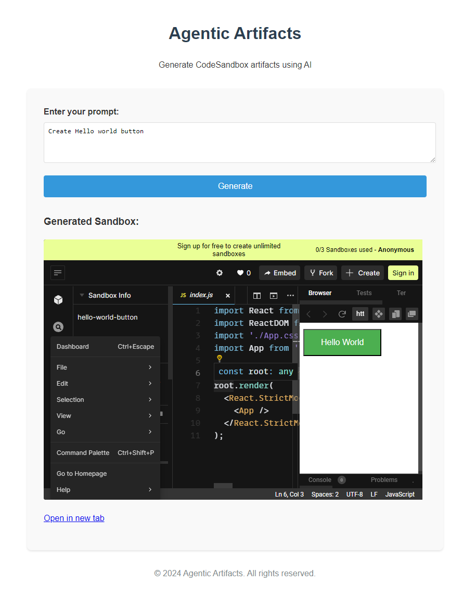

# Agentic Artifacts

Agentic Artifacts is a tool for generating and managing CodeSandbox artifacts using AI. It leverages the power of GPT-4o to create React components and other web development artifacts based on user prompts.

## Features

- Generate React components and other web artifacts using AI
- Automatically create and manage CodeSandbox environments
- Error detection and automatic code fixing
- Support for multiple CodeSandbox environments (React, Python, Next.js, FastAPI, etc.)
- Web-based UI for easy interaction
- Command-line interface for advanced users




## Installation

1. Clone the repository:
   ```sh
   git clone https://github.com/ruvnet/agentic-artifacts.git
   cd agentic-artifacts
   ```

2. Install the required dependencies:
   ```sh
   pip install -r requirements.txt
   ```

3. Set up your environment variables:
   Create a `.env` file in the root directory and add your API keys:
   ```sh
   OPENAI_API_KEY=your_openai_api_key
   CODESANDBOX_API_KEY=your_codesandbox_api_key
   ```

## Usage

1. Install the package in editable mode:
   ```sh
   pip install -e .
   ```

To start the Agentic Artifacts server:

```sh
agentic-artifacts
```

## Project Structure

```
agentic-artifacts/
│
├── agentic_artifacts/
│   ├── __init__.py
│   ├── api/
│   │   ├── __init__.py
│   │   └── routes.py
│   ├── models/
│   │   ├── __init__.py
│   │   └── sandbox.py
│   ├── services/
│   │   ├── __init__.py
│   │   ├── code_generator.py
│   │   └── sandbox_manager.py
│   ├── ui/
│   │   ├── static/
│   │   │   ├── styles.css
│   │   │   └── script.js
│   │   └── templates/
│   │       └── index.html
│   └── utils/
│       ├── __init__.py
│       └── config.py
│
├── tests/
│   └── __init__.py
│
├── install.sh
├── requirements.txt
├── setup.py
├── README.md
└── main.py
```

## Contributing

Please read [CONTRIBUTING.md](./CONTRIBUTING.md) for details on our code of conduct, and the process for submitting pull requests.

## License

This project is licensed under the MIT License - see the [LICENSE.md](LICENSE.md) file for details.
